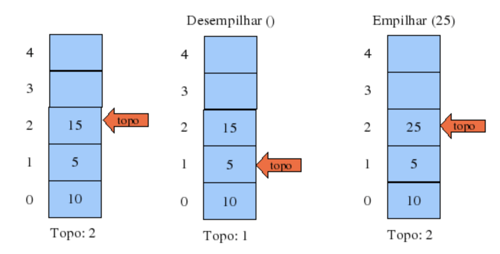
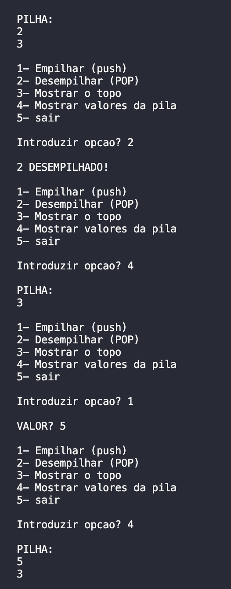

<h1 align="center">
    
</h1>

Trabalho em Ocaml

Funcionamento de uma Pila LIFO(Last In First Out) 
    
Programa em linguagem Ocaml padrão, de nome camiao.ml, que permita efetuar o teste de um programa.
O programa recebe valores inteiros, e permite empilar e desempilar e mostra os valores na ordem que vão ficando:

📌 Programa sobre # Pila
Funcionamento de uma Pila LIFO(Last In First Out)
------------------

## Sintaxe para compilar:

<pre>ocamlopt camiao.ml -o camiao </pre>

## Sintaxe para executar:
<pre>./camiao </pre>

## Tambem pode executar diretamente: 
<pre>ocaml camiao.ml</pre>

O projeto foi feito em Ocaml.

The project was done with Ocaml.

🔧 Tecnologias utilizadas:
------------------

- Ocaml

💬 Fale comigo
------------------
[*Entre em contato comigo*](https://www.linkedin.com/in/ivo-baptista-3712144/)

